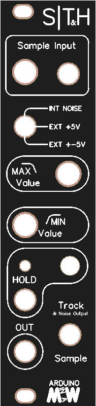

# S|T&H (SITH) Arduino-Sample-and-Hold

S|TH is a simple arduino based Sample (or Track) and Hold with a bunch of nifty features like interna noise and adjustable output cv-range. Built with Port manipulation to support 10 bit output for 1023 step resolution.

It is a DIY module, and uses an Arduino Nano as the brains of the module using Port manipulation with an r2r ladder for the CV output. I did a whole bunch of videos on the different aspects of this video which you can see here:

Explaining PORT MANIPULATION: https://youtu.be/IoJasVtr0OA

Part1: https://youtu.be/7Mhq-GJlMeM

Part2: https://youtu.be/WDeVrf_H2IQ

Part3: https://youtu.be/BoewbbyEvRc

here is the build video: https://youtu.be/z-7DU65izWw

You can buy the PCB and Panel and or components here: 
https://www.tindie.com/products/Sourcery/sth-sith-sample-or-track-and-hold/

Or you can download the files from this page and order the parts yourself, or even just follow the schematics and use protoboard or similar to build it.
What makes it a bit special is the Max and Min pots which makes it so you can tweak the range of the cv output. Also with some fun effects by inverting the output for some fun effects. You also have an internal noise source which you can output by using the internal noise source and going into Track mode. This will output the noise as long as hold is not triggered.

